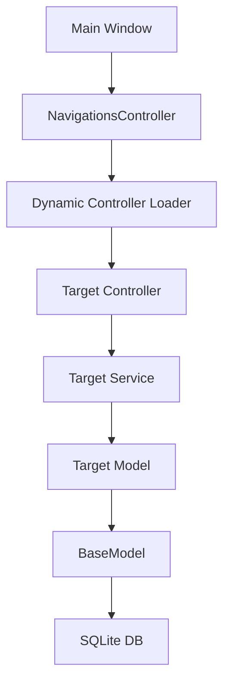

# Core CMS Documentation

> [!IMPORTANT]
> This documentation covers the core functionalities of the cms CMS. Any modifications to these systems can have widespread effects on the entire application.

## 1. System Overview

### Architecture Overview

The cms application follows a strict **Model-View-Controller (MVC)** architecture built on Python (Tkinter) and SQLite.

- **Models (`models/`)**: Handle data logic, database interactions, and business rules. All models inherit from `BaseModel`.
- **Views (`views/`)**: Handle the user interface. Built using Tkinter/ttk. Use a component-based design (e.g., `TableView`, `MainWindow`).
- **Controllers (`controllers/`)**: Act as the glue between Models and Views. Handle user input, call service methods, and return data to views.
- **Services (`services/`)**: Encapsulate business logic to keep controllers thin.
- **Database**: SQLite (`data/data.db`).

### Key Technologies

- **Language**: Python 3.10+
- **GUI**: Tkinter + ttk
- **Database**: SQLite3
- **Dependency Management**: Standard Library (no external pip requirements for core, `google-auth` for sync).

---

## 2. Access Levels & Role Permissions

### Overview

The system uses a Role-Based Access Control (RBAC) system defined in the `access_levels` table. Permissions are granular and linked to specific **Navigation IDs**.

### Database Structure

- **Table**: `access_levels`
- **Columns**:
  - `view`, `add`, `edit`, `delete`, `export`, `import`: Contain CSV strings of Navigation IDs (e.g., "1,2,5").

### Authorization Flow

1.  **User Login**: User is authenticated via `AuthController` -> `AuthService`.
2.  **Session Start**: `Session.set_user(user)` stores the user object and their `access_level_id`.
3.  **Navigation Loading**: The main menu (`views/main_window.py`) queries `Navigations` and filters them based on the user's `access_level.view` permission.
4.  **Action Gating**:
    - In `TableView`, buttons (Add, Edit, Delete) are visible ONLY if the user's access level includes the current page's Navigation ID in the respective permission column (e.g., `can_add`).
    - Controllers should verify permissions before executing actions (though implementation varies).

> [!WARNING]
> **Critical Logic**: The `Session` singleton (`utils/session.py`) is the source of truth for the current user. Never bypass `Session.get_user()` when checking permissions.

---

## 3. CMS Navigation Structure

### Overview

Navigation is dynamic and driven by the `navigations` database table. It supports nested menus (Parent -> Child).

### Database Structure

- **Table**: `navigations`
- **Key Columns**:
  - `navigation_type`:
    - `menu`: Standalone menu item.
    - `parent_menu`: Collapsible container for child items.
    - `child_menu`: Item inside a parent menu.
    - `menu_header`: Label separator.
  - `controller`: The partial class name of the controller to load (e.g., `Users` -> loads `controllers.UsersController`).
  - `navigation`: The internal slug/route ID.
  - `datatable_settings`: JSON configuration for the `TableView` (columns, visibility).

### flow

1.  **Route Resolution**: `MainWindow` listens for navigation events.
2.  **Controller Loading**: It dynamically imports the controller module based on the `controller` field in the database.
3.  **View Rendering**: It calls `Controller.index()` to get the view configuration (usually a `TableView` or a custom View).

---

## 4. CRUD Builder System

### Purpose

Allows rapid generation of new modules (Table, Model, Service, Controller, Migration) via the UI without writing code.

### Architecture

- **Entry Point**: `controllers/CrudBuilderController.py`
- **Service**: `services/CrudBuilderService.py`
- **Definitions**: `crud_definitions` table stores the metadata.

### How it Works

1.  **Definition**: Admin defines fields (name, type, Alias) in the UI.
2.  **Generation**: `CrudBuilderService` generates Python files:
    - `models/{Name}.py`: Subclass of `BaseModel`.
    - `controllers/{Name}Controller.py`: Standard CRUD methods.
    - `services/{Name}Service.py`: Logic layer.
    - `migrations/xxxx_create_{name}.py`: Database schema.
3.  **Auto-Wiring**: The service inserts a record into `navigations` to make the module instantly accessible.

> [!CAUTION]
> **Modification Risk**: The `CrudBuilderService` writes actual `.py` files to the disk. Modifying this service requires extreme care to avoid corrupting the codebase or generating invalid syntax.

---

## 5. Custom View Files

While most modules use the generic `TableView`, specific features use custom views located in `views/`.

| Component         | View File                   | Purpose                                     |
| :---------------- | :-------------------------- | :------------------------------------------ |
| **Login**         | `views/login/login_view.py` | User authentication screen.                 |
| **Main Layout**   | `views/main_window.py`      | The shell application, sidebar, and header. |
| **Generic Table** | `views/table/table_view.py` | The heart of the CMS, renders data grids.   |
| **CRUD Builder**  | `views/crud_builder/`       | Form for creating new modules.              |

---

---

## 6. Google Sheet Integration (Core Utility)

### Overview

The system includes a built-in `GoogleSheetService` that facilitates one-way synchronization of data from the CMS to Google Sheets. While primarily used for Orders, this is a **Core Utility** designed to be reused by any module.

- **Service File**: `services/GoogleSheetService.py`
- **Dependencies**: `google-auth`, `google-api-python-client` (Optional, required only if feature is used).

### Configuration

The integration is controlled via the `settings` table:

- `google_service_account`: JSON string containing the Google Cloud Service Account credentials.
- `google_sheet_id`: The ID of the target Google Sheet.

### Core Features available to all modules:

1.  **Connection Validation**: `validate_connection()` tests read/write access.
2.  **Sheet Management**: `ensure_sheet(name, headers)` automatically creates tabs if they are missing.
3.  **Data Synchronization**: `update_or_append_data()` handles the logic of matching records by ID (row-matching) or appending new ones.
4.  **User Tracking**: `sync_user_to_sheet()` maintains a roster of users and their last login times in the external sheet.

> [!TIP]
> **Extensibility**: To add sync to a new module (e.g., "Products"), you simply need to call `GoogleSheetService.update_or_append_data` within your Controller's store/update methods.

---

## 7. Core Controllers & Services

### Base Components

- **`models/BaseModel.py`**: The parent of ALL models. Handles:
  - `index_sqlite`, `store_sqlite`, `update_sqlite`, `destroy_sqlite`
  - **Audit Logic**: Automatically populates `created_by`, `updated_by` from Session.
- **`services/BaseService.py`**: Generic service logic.
- **`utils/session.py`**: Manages the logged-in user state.

### Dependency Relationships

---

## 8. Critical Flow Protection Areas

The following areas are **Core Infrastructure** and should NOT be modified unless you are performing a framework-level upgrade:

1.  **`models/BaseModel.py`**:
    - **Reason**: It powers every single database interaction. A bug here breaks the entire app.
    - **Critical Logic**: Audit field auto-population.

2.  **`utils/session.py`**:
    - **Reason**: If this fails, no one can log in, and permissions break.

3.  **`views/main_window.py`**:
    - **Reason**: Controls the routing and main frame. Errors here cause a white screen on launch.

4.  **`services/CrudBuilderService.py` (File Generation Logic)**:
    - **Reason**: Incorrect template string generation will permanently break any future modules created.

5.  **Database Migration System (`migrate.py`, `run_migrations.py`)**:
    - **Reason**: manages the schema evolution.
